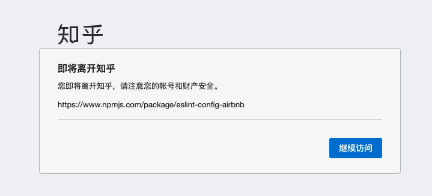
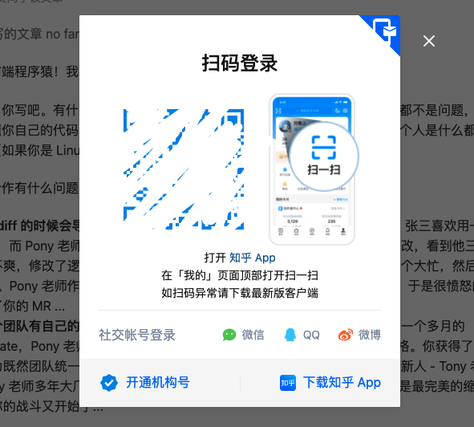
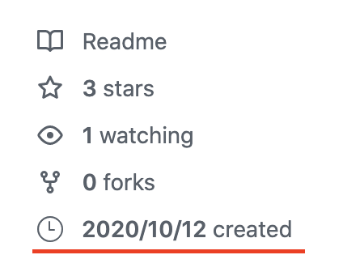
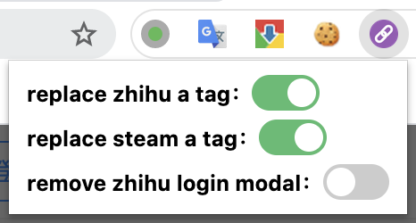
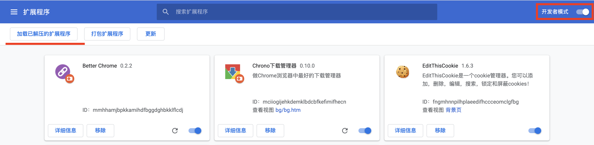

### Better Chrome

chrome 扩展程序，矫正 a 标签，去除登录弹窗

 

 

#### 支持开关控制

#### 网站列表

- [x] **知乎** - 替换 a 标签
- [x] **知乎** - 去除未登录弹窗
- [x] **steam** - 替换 a 标签
- [x] **掘金** - 替换 a 标签
- [x] **csdn** - 替换 a 标签
- [x] **csdn** - 去除未登录弹窗
- [x] **github** - 显示库创建时间

#### 安装

- 打开 chrome 扩展程序的开发者模式
- 在项目根目录，加载已解压的扩展程序

